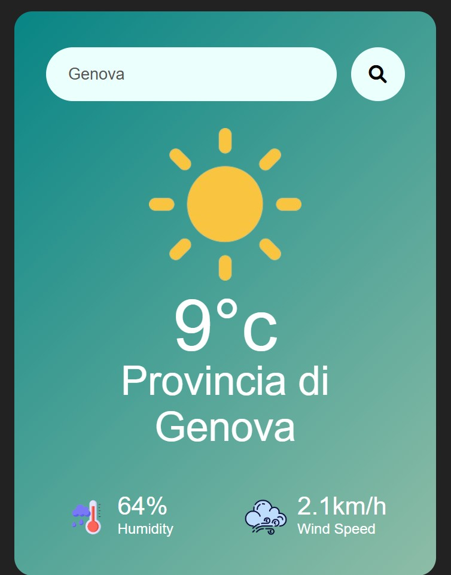

# Weather Forecast Web App

A simple web application to display weather forecasts for any city in the world. This project is built using **HTML**, **CSS**, and **JavaScript**, and it leverages the OpenWeather API to fetch real-time weather data.

## Features

- Search for weather information by city name.
- Display current weather conditions including temperature, humidity, wind speed, and weather description.

## Prerequisites

Before running the project, ensure you have the following:

- A valid API key from [OpenWeather](https://openweathermap.org/).

## Setup

1. Clone the repository:
   ```bash
   git clone https://github.com/your-username/weather-forecast-app.git
   cd weather-forecast-app
   ```

2. This project uses only HTML, CSS, and JavaScript.

3. Configure the environment:
   - Create a file named `env.js` in the root directory of the project.
   - Use the `env.example.js` file as a template for your `env.js` file.
4. Open the `index.html` file in your browser to view the application.


## Usage

1. Open the application in your browser.
2. Enter the name of a city in the search bar.
3. View the current weather details for the selected city.



## Notes

- The `env.js` file is excluded from version control for security reasons. Ensure you do not share your API key publicly.
- If you encounter issues with the API, refer to the [OpenWeather API documentation](https://openweathermap.org/api).

## License

This project is open-source and available under the [MIT License](LICENSE).

---

Happy coding!
